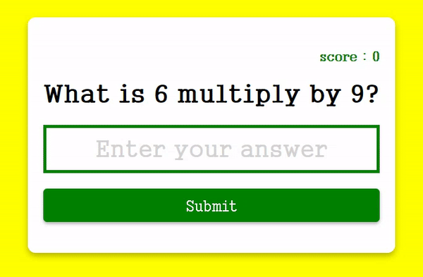

# Multiplication-App


## 기능
곱하기 문제 풀면, 맞으면 score +, 틀리면 score - 

## 학습 
### 1. JS : Math.ceil() 
항상 반올림하여 주어진 숫자보다 크거나 같은 가장 작은 정수를 반환   
```
console.log(Math.ceil(0.95));
// Expected output: 1

console.log(Math.ceil(4));
// Expected output: 4

console.log(Math.ceil(7.004));
// Expected output: 8

console.log(Math.ceil(-7.004));
// Expected output: -7

```

### 2. JS : submit 이벤트  
`<form>` 제출 시 실행    

예) 양식이 제출되면 함수를 호출합니다.   
```
<form onsubmit="myFunction()">
  Enter name: <input type="text">
  <input type="submit">
</form>
```

### 3. JS : JSON.stringify()  
**자바스크립트 객체를 JSON 문자열로 전환**    

JSON의 일반적인 용도는 웹 서버와 데이터를 교환하는 것입니다. 웹 서버에 데이터를 보낼 때 데이터는 문자열입니다. 그러므로 JSON.stringify()을 사용하여 JavaScript 개체를 문자열로 변환합니다.

```
const obj = {name: "John", age: 30, city: "New York"};
const myJSON = JSON.stringify(obj);
```


## 학습 출처
- 유튜브     
https://www.youtube.com/@JavaScriptKing   

- JS     
https://ko.javascript.info/forms-submit     
https://www.w3schools.com/jsref/event_onsubmit.asp     
https://www.w3schools.com/js/js_json_stringify.asp      

